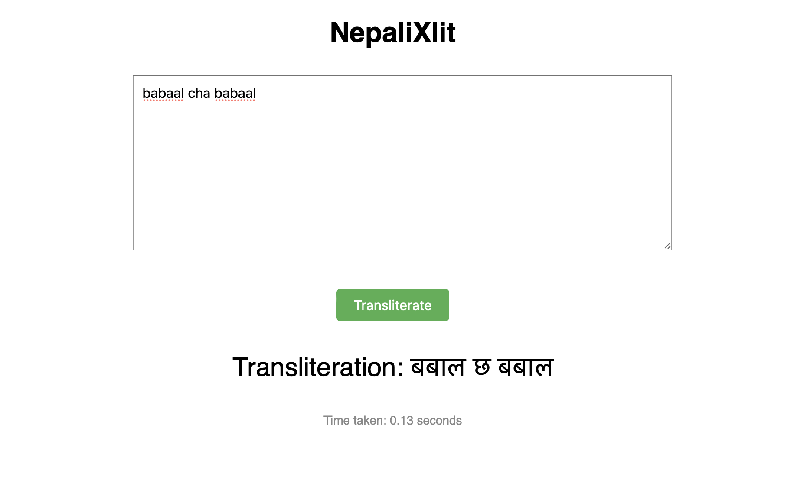

# Nepali Transliterator (NepaliXlit) Webapp

**Adaptation of [IndicXlit](https://github.com/AI4Bharat/IndicXlit) for Nepali systems.**

<hr>

Follow the instructions to run the app on your system

1. Create a virtual environment, so dependencies don't clash

    ```
    python3 -m venv venv
    source venv/bin/activate
    ```

2. Move to the app folder

    ```
    cd app
    ```

3. Install the necessary dependencies

    ```
    pip install -r app/dependencies.txt
    ```

4. Run the application
    
    ```
    python3 app.py
    ```

    Your app will be live at `http://127.0.0.1:8000`
    
    It will take a few minutes for the first time to download the model and initialize the system.

<hr>

